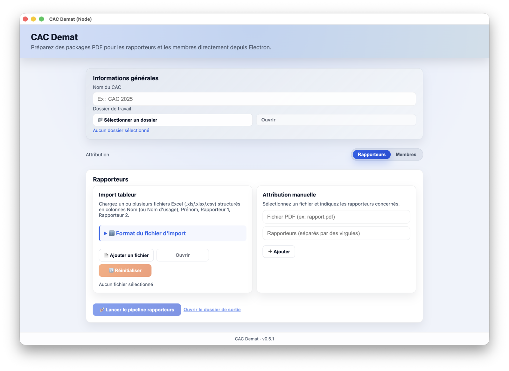
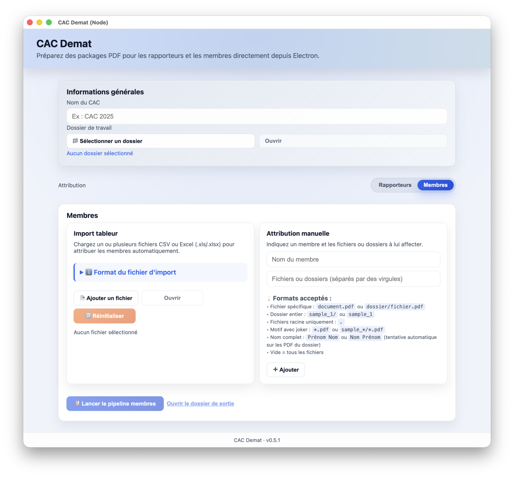
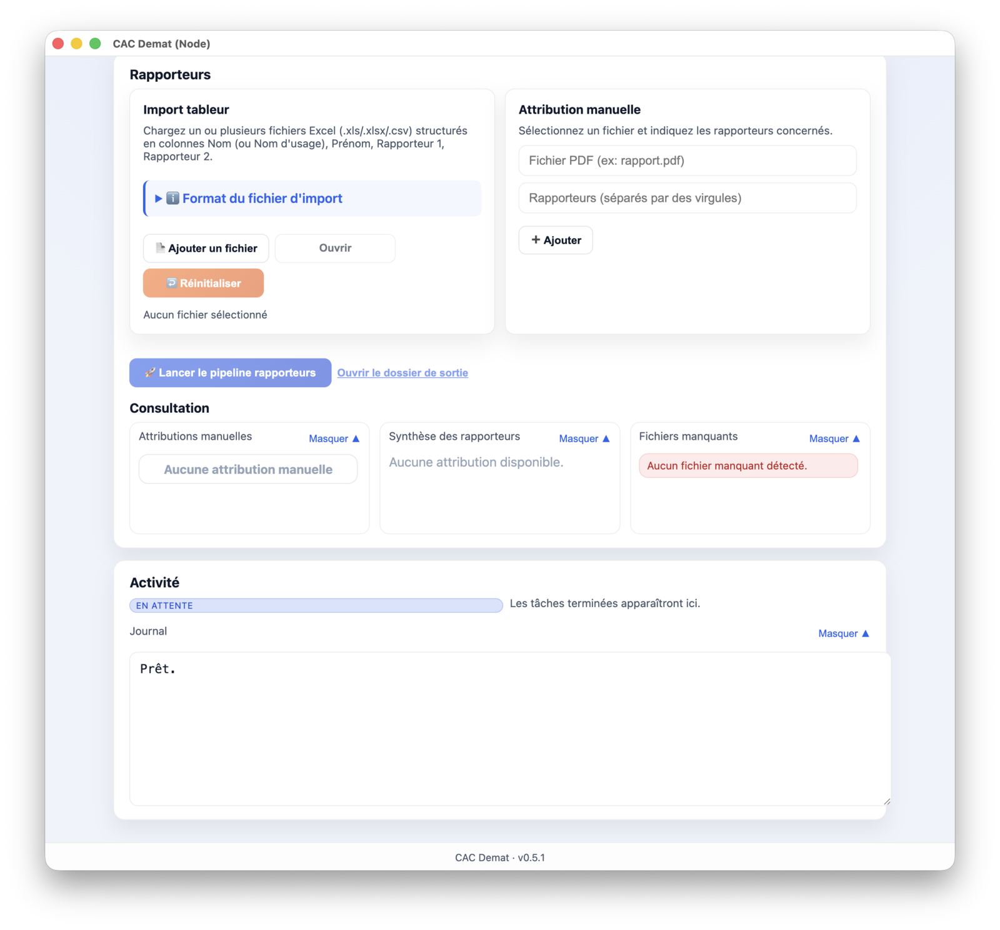

# Documentation Utilisateur - CAC Demat

Bienvenue dans la documentation de **CAC Demat**, l'application destinée à faciliter la préparation des packages PDF pour les rapporteurs et les membres du CAC.

## Introduction

**CAC Demat** automatise la distribution des dossiers de candidature. Elle permet de :
*   Associer des rapporteurs à des candidats (PDF) via un fichier Excel/CSV.
*   Attribuer des dossiers (ou des dossiers entiers) aux membres de la commission.
*   Générer des dossiers organisés prêts à être partagés.

# Installation et Lancement

L'application est disponible pour **Windows**, **macOS** et **Linux**.

1.  Téléchargez la dernière version depuis la page des [Releases](https://github.com/sohaibafifi/cac-demat/releases).
2.  Installez l'application (fichier `.exe`, `.dmg` ou `.AppImage`).
3.  Lancez **CAC Demat**.

> **Note :** Aucune authentification n'est requise. L'application fonctionne entièrement en local sur votre machine.

# Interface Principale

À l'ouverture, vous accédez à l'écran principal composé de trois zones :
1.  **En-tête** : Titre et version.
2.  **Configuration Générale** : Paramètres communs.
3.  **Onglets d'Attribution** : Choix entre "Rapporteurs" et "Membres".

### Informations Générales

Avant toute action, renseignez les informations de base :

*   **Nom du CAC** : Le nom de la session (ex: `CAC 2025`). Ce nom sera utilisé pour nommer les dossiers générés.
*   **Dossier de travail** : Cliquez sur **"Sélectionner un dossier"** pour choisir le répertoire contenant tous les fichiers PDF des candidats.

> ⚠️ **Important :** Tous les fichiers PDF (candidatures) doivent se trouver dans ce dossier ou ses sous-dossiers. L'application scannera ce répertoire pour trouver les fichiers correspondants aux noms.

---

# Gestion des Rapporteurs

Onglet : **Rapporteurs**

## Import Automatique (Tableur)

C'est la méthode recommandée pour traiter un grand nombre de dossiers.

1.  Préparez un fichier Excel (`.xlsx`, `.xls`) ou CSV.
2.  Structurez-le avec les colonnes suivantes :
    *   `Nom` (ou `Nom d'usage`)
    *   `Prénom`
    *   `Rapporteur 1`
    *   `Rapporteur 2` (optionnel)
3.  Dans l'application, section "Import tableur", cliquez sur **"Ajouter un fichier"**.
4.  L'application analyse le fichier et tente de faire correspondre chaque candidat avec un PDF du dossier de travail.

> **Astuce :** Cliquez sur "ℹ️ Format du fichier d'import" dans l'application pour voir des exemples concrets.

## Attribution Manuelle (Rapporteurs)

Pour corriger un oubli ou gérer un cas spécifique :

1.  Allez dans le formulaire "Attribution manuelle".
2.  **Fichier PDF** : Commencez à taper le nom du fichier, une liste de suggestion apparaîtra (basée sur le contenu du dossier de travail).
3.  **Rapporteurs** : Saisissez les noms, séparés par des virgules (ex: `M. Dupont, Mme Martin`).
4.  Cliquez sur **"Ajouter"**.

## Lancement du Pipeline (Rapporteurs)

Une fois les attributions configurées :

1.  Cliquez sur le bouton bleu **"🚀 Lancer le pipeline rapporteurs"**.
2.  Une barre de progression (ou un indicateur d'état) s'affiche.
3.  À la fin, un message vous confirme le nombre de dossiers générés.
4.  Cliquez sur **"Ouvrir le dossier de sortie"** pour vérifier le résultat.

---

# Gestion des Membres

Onglet : **Membres**

## Import Automatique (Membres)

Permet de distribuer des lots de dossiers à des membres.

*   **Fichier source** : CSV ou Excel.
*   **Format** :
    *   `Membre` : Nom du membre.
    *   `Fichier 1`, `Fichier 2`... : Noms des fichiers ou dossiers à attribuer.
    *   Valeurs acceptées : `*.pdf` (tous les PDF), `dossier_A/`, `nom_candidat.pdf`.

> **Astuce :** Cliquez sur "ℹ️ Format du fichier d'import" dans l'application pour voir des exemples concrets.

> **Recommandation :** Il est recommandé de préparer des répertoires types par type de membres (MCF, PR, etc.) et de leur affecter ces répertoires.

## Attribution Manuelle (Membres)

1.  **Nom du membre** : Saisissez le nom.
2.  **Fichiers** : Saisissez les fichiers ou motifs (ex: `*.pdf` pour tout donner, ou `Dossier_Maths/*`).
3.  Cliquez sur **"Ajouter"**.

## Lancement du Pipeline (Membres)

Cliquez sur **"🛡️ Lancer le pipeline membres"**. L'application créera un dossier par membre contenant les fichiers demandés.

---

# Fonctionnalités Avancées

Pour accéder aux outils de diagnostic :
*   Menu **Affichage** > **Mode avancé**.

Une fois activé, de nouvelles sections apparaissent en bas de l'interface.

## Logs et Activité

La section **Activité** affiche un journal détaillé de toutes les actions :
*   Fichiers trouvés et non trouvés.
*   Erreurs lors de la lecture des Excel.
*   Détails de la copie des fichiers.

## Consultation des Attributions

Des panneaux récapitulatifs permettent de vérifier :
*   **Membres manuels / Rapporteurs manuels** : Liste des ajouts manuels.
*   **Synthèse** : Qui a accès à quoi.
*   **Fichiers manquants** : Liste des candidats présents dans l'Excel mais dont le fichier PDF n'a pas été trouvé dans le dossier de travail.

> **En cas de fichier manquant :** Vérifiez l'orthographe du fichier ou renommez-le pour qu'il corresponde au nom dans l'Excel (Nom + Prénom).
